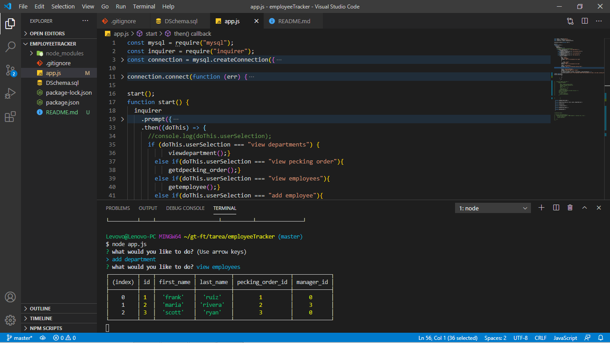

# trabajodor

Is a command line aplication fuzed with mysql that allows the user to retrive and imput data from a database using the program in the cla.

There are alot of bugs in the aplication first one the user will notice
when the aplication is rund and the user prompt to his option a sychronicity
bug flickers the on the terminal. I also command line is not able to update a employee. the app does break when trying to update any of the data. but it is able to show the department  the pecking_order/roll and the employee info.
 
 //code talk app.js file line 44-72
 is the prompt for getting the users data and updating it to the mysql database but was not successful.

 

[this the link to the video](https://drive.google.com/file/d/1m1YzMDqCSCRnXr5LD5tpnU7bgpPg2hc-/view)
